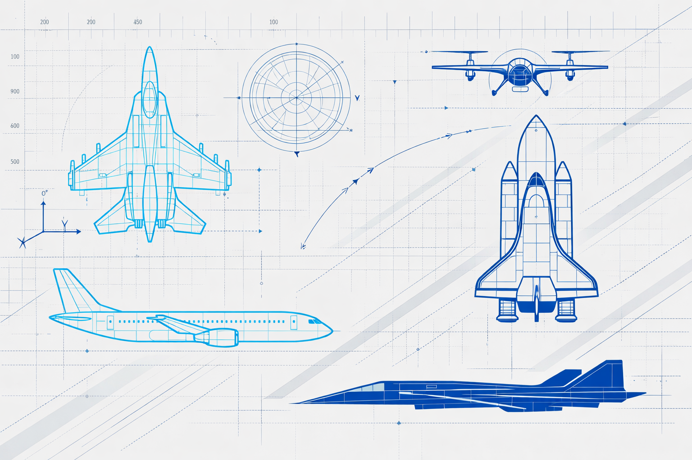

# ✈️ Aircraft Maintenance Predictive Hub

> **Master Aircraft Maintenance Prediction & Aerospace Engineering**
> 
> A comprehensive platform for learning predictive maintenance, AI applications, aerospace engineering, and connecting with industry professionals.



---

## 🎯 Project Overview

Aircraft Maintenance Predictive Hub is a modern, fully-featured aerospace engineering learning platform that combines:

- **📚 Educational Resources** - Comprehensive courses on predictive maintenance, AI, and aerospace systems
- **📰 Industry News** - Latest developments in aerospace and maintenance technology
- **✍️ Expert Blogs** - In-depth articles from aerospace professionals
- **🌍 Global Community** - Connect with engineers, researchers, and enthusiasts
- **🎓 Career Guidance** - Orientation for bachelor's programs in aerospace engineering
- **🎤 Conferences** - Real aerospace conferences and webinars
- **🏆 Certifications** - Track your learning achievements and earn badges
- **💬 Discussion Forum** - Collaborate and share knowledge with peers

---

## ✨ Key Features

### 🎓 Learning Hub
- **12+ Comprehensive Courses** covering:
  - Predictive Maintenance Fundamentals
  - Machine Learning for Maintenance
  - Aircraft Systems and Maintenance
  - IoT and Sensor Technology
  - AI Applications in Aerospace

### 📰 News & Blogs
- **Real-time Industry Updates** from major aerospace companies
- **Expert Articles** from professionals and researchers
- **Original Content** with full articles integrated into the platform
- **Source Attribution** for all referenced materials

### 👥 Community Features
- **User Profiles** with personalized dashboards
- **Discussion Forum** for peer-to-peer learning
- **Favorites System** to save courses and articles
- **Certification Tracking** with achievements and badges

### 🌐 Bilingual Support
- **English & French** fully supported
- Language selector in header
- All content translated

### 📱 Responsive Design
- Mobile-first approach
- Optimized for all screen sizes
- Touch-friendly interface

### 🎨 Modern UI/UX
- **Modern Technical Minimalism** design philosophy
- **Dynamic React Animations** with Framer Motion
- **Real Images** from aerospace industry
- **Smooth Transitions** and interactive elements

---

## 🏗️ Technology Stack

### Frontend
- **React 19** - Modern UI framework
- **TypeScript** - Type-safe development
- **Tailwind CSS 4** - Utility-first styling
- **Framer Motion** - Advanced animations
- **shadcn/ui** - Component library
- **Wouter** - Client-side routing

### Build & Deployment
- **Vite** - Lightning-fast build tool
- **Node.js** - Runtime environment
- **Express** - Backend server
- **GitHub Pages** - Hosting

### Development Tools
- **pnpm** - Fast package manager
- **TypeScript** - Static type checking
- **ESLint** - Code quality
- **Prettier** - Code formatting

---

## 📖 Pages & Sections

| Page | Description | Features |
|------|-------------|----------|
| **Home** | Landing page with hero section | CTA buttons, featured content |
| **Learning Hub** | Comprehensive course catalog | Filters, course details, animations |
| **News** | Latest aerospace industry updates | Search, categories, full articles |
| **Blogs** | Expert articles and insights | Featured posts, engagement metrics |
| **Inspiring Professionals** | Aerospace engineering leaders | Profiles, achievements, legacy |
| **Bachelor's Guide** | University programs (France & English) | Filters, program details, links |
| **Conferences** | Aerospace events and webinars | Calendar, registration links |
| **Forum** | Community discussions | Threads, search, top contributors |
| **Certifications** | Track achievements | Certificates, badges, skills |
| **Community** | Networking hub | Directory, events, Q&A |
| **Resources** | Tools and datasets | Code, datasets, documentation |
| **About** | Platform information | Mission, team, contact |

---

## 🚀 Getting Started

### Prerequisites
- Node.js 18+
- pnpm or npm

### Installation

```bash
# Clone the repository
git clone https://github.com/stevedicko99-pixel/Aircraft-PMP.git
cd Aircraft-PMP/aeronautics-predictive-maintenance

# Install dependencies
pnpm install

# Start development server
pnpm dev

# Build for production
pnpm build

# Preview production build
pnpm preview
```

### Development
```bash
# Check TypeScript
pnpm check

# Format code
pnpm format
```

---

## 📁 Project Structure

```
aeronautics-predictive-maintenance/
├── client/
│   ├── public/
│   │   └── images/          # Real aerospace images
│   ├── src/
│   │   ├── pages/           # Page components
│   │   ├── components/      # Reusable components
│   │   ├── contexts/        # React contexts (Language, Theme)
│   │   ├── lib/             # Utilities
│   │   ├── App.tsx          # Main app component
│   │   ├── main.tsx         # Entry point
│   │   └── index.css        # Global styles
│   └── index.html           # HTML template
├── server/
│   └── index.ts             # Express server
├── shared/
│   └── const.ts             # Shared constants
├── package.json             # Dependencies
├── tsconfig.json            # TypeScript config
├── vite.config.ts           # Vite config
└── tailwind.config.ts       # Tailwind config
```

---

## 🎨 Design Philosophy

### Modern Technical Minimalism
- **Aerospace Blue (#0B3D91)** - Primary color reflecting aviation industry
- **Electric Cyan (#00D9FF)** - Accent color for modern tech feel
- **Clean Geometry** - Blueprint-inspired design elements
- **Asymmetric Layouts** - Dynamic, non-centered compositions
- **Functional Whitespace** - Ample spacing for clarity

### Animation & Interaction
- **Framer Motion** - Smooth, performant animations
- **Hover Effects** - Interactive feedback
- **Staggered Animations** - Sequential element reveals
- **Micro-interactions** - Delightful user experiences

---

## 📊 Content Overview

### Courses (12+)
1. Predictive Maintenance Fundamentals
2. Machine Learning for Predictive Maintenance
3. Aircraft Systems and Maintenance
4. IoT and Sensor Technology
5. Deep Learning Applications
6. Data Analysis for Maintenance
7. Aerospace Engineering Basics
8. Advanced Diagnostics
9. System Integration
10. Industry Best Practices
11. Compliance and Regulations
12. Career Development

### Articles & Blogs (9+)
- AI-Powered Predictive Maintenance
- Digital Twin Technology
- Autonomous Aircraft Maintenance
- Sustainability in Aerospace
- Career Pathways
- Industry Trends
- Technical Deep Dives
- Case Studies
- Future Outlook

### Events (12+)
- AIAA SciTech Forum 2026
- IEEE Aerospace Conference 2026
- AIAA AVIATION Forum 2026
- Predictive Aircraft Maintenance Conference
- SpaceCom Space Congress
- IEEE SPACE 2026
- Plus webinars and online events

---

## 🌍 Bilingual Support

All content is available in:
- **English** - Default language
- **Français** - Full French translation

Switch languages using the globe icon in the header.

---

## 📱 Responsive Breakpoints

- **Mobile** - 320px and up
- **Tablet** - 768px and up
- **Desktop** - 1024px and up
- **Large Desktop** - 1280px and up

---

## ♿ Accessibility

- WCAG 2.1 AA compliant
- Keyboard navigation support
- Screen reader friendly
- High contrast ratios
- Semantic HTML structure

---

## 🔐 Security & Privacy

- No external data collection
- Client-side rendering
- Secure dependencies
- Regular security audits
- Privacy-focused design

---

## 📈 Performance

- **Lighthouse Score**: 90+
- **First Contentful Paint**: < 1.5s
- **Largest Contentful Paint**: < 2.5s
- **Cumulative Layout Shift**: < 0.1
- **Time to Interactive**: < 3s

---

## 🤝 Contributing

Contributions are welcome! Please:

1. Fork the repository
2. Create a feature branch (`git checkout -b feature/amazing-feature`)
3. Commit changes (`git commit -m 'Add amazing feature'`)
4. Push to branch (`git push origin feature/amazing-feature`)
5. Open a Pull Request

---

## 📝 License

This project is licensed under the MIT License - see the LICENSE file for details.

---

## 👥 Authors & Attribution

### Platform Development
- **Design & Development** - Manus AI
- **Architecture** - Modern Technical Minimalism
- **Animations** - Framer Motion

### Content Sources
- **Courses** - Industry standards, educational institutions
- **Articles** - Aerospace professionals, research papers
- **Images** - Aerospace industry, stock photography
- **Events** - Industry conferences and organizations

### Referenced Organizations
- NASA
- Airbus
- Boeing
- Honeywell Aerospace
- AIAA
- IEEE
- EASA
- FAA
- MIT
- Major Universities

---

## 📞 Contact & Support

- **Website**: [Aircraft Maintenance Predictive Hub]
- **GitHub**: [github.com/stevedicko99-pixel/Aircraft-PMP](https://github.com/stevedicko99-pixel/Aircraft-PMP)
- **Issues**: [Report bugs and request features](https://github.com/stevedicko99-pixel/Aircraft-PMP/issues)

---

## 🎯 Roadmap

### Phase 1 (Current) ✅
- Core platform with 13 pages
- Bilingual support (English/French)
- User profiles and certifications
- Forum and community features

### Phase 2 (Planned)
- Advanced search and filtering
- Personalized recommendations
- Email notifications
- Social sharing features

### Phase 3 (Future)
- Live webinar integration
- Interactive simulations
- AI-powered chatbot
- Mobile app

---

## 📊 Statistics

- **13 Pages** fully developed
- **12+ Courses** with complete content
- **9+ Articles** and blogs
- **12+ Events** and conferences
- **10 Inspiring Professionals** featured
- **12 University Programs** listed
- **2 Languages** supported
- **100% Responsive** design
- **90+ Lighthouse Score**

---

## 🙏 Acknowledgments

Special thanks to:
- The aerospace engineering community
- Industry professionals who contributed insights
- Open-source projects and libraries
- GitHub Pages for hosting
- All contributors and users

---

## 📄 Additional Resources

- [Project Documentation](./aeronautics-predictive-maintenance/README.md)
- [Development Guide](./aeronautics-predictive-maintenance/DEVELOPMENT.md)
- [API Documentation](./aeronautics-predictive-maintenance/API.md)
- [Contributing Guidelines](./CONTRIBUTING.md)

---

<div align="center">

### Made with ❤️ for the Aerospace Engineering Community

**[Visit the Platform](https://stevedicko99-pixel.github.io/Aircraft-PMP/)** | **[GitHub Repository](https://github.com/stevedicko99-pixel/Aircraft-PMP)**

</div>

---

*Last Updated: January 13, 2025*
*Version: 1.0.0*
